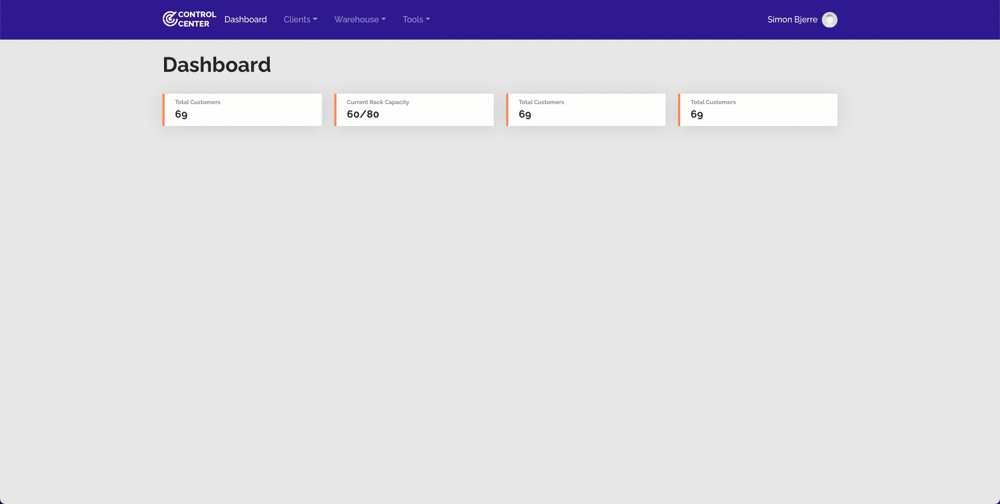

<div align="center">
  
</div>

### Description
A MSP Client management tool used for managing processes, access information, passwords, guide and know-how and links to common recources.

## Project Goals
* Manage clients/ companies
* Manage process documentaion
* Manage/ link to password store
* Simple warehouse module
* Send Emails (via MS365)
* Print Labels
* Location Item

## Project technologies/ Libs
* React
* React Router ( Routes )
* React Bootstrap ( UI Framework )
* mongodb ( Database )
* mongoose ( Database Connector )
* Auth0 ( Central Authentication )
* Dymojs (Print Labels useing Dymo Printers)



## Setup project
Create a .env file in root of /srv

Add the following lines to your .env withe the correct information.
```
DB_USERNAME
DB_PASSWORD
MAIL_FROM
MAIL_AUTH_USER
MAIL_AUTH_PASS
```

And on line 14 of server.js change the MongoDB Atlas url to your DB