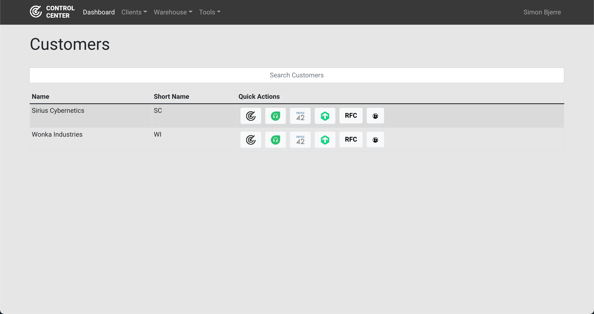
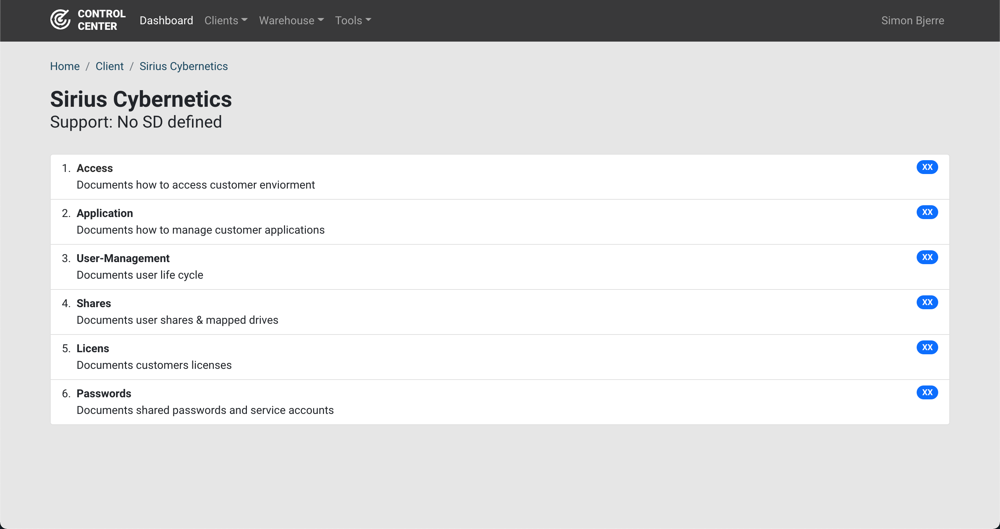

  

# CC - Control Center
A MSP Client management tool used for managing processes, access information, passwords, guide and know-how and links to common recources.

## Project Goals
* Manage clients/ companies
* Manage process documentaion
* Manage/ link to password store
* Simple warehouse module
* Send Emails (via MS365)

## Project technologies/ Libs
* React
* React Router
* React Bootstrap
* mongodb
* mongoose
* Auth0 (eventialuly)

